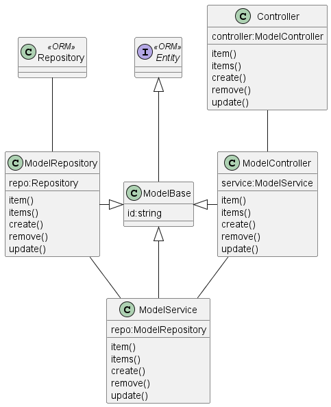

# React Native com Expo-Sqlite

## Estrutura de diretórios

A estrutura inicial de diretórios do projeto é a seguinte:

```
-> src -> app
-- --  -> cp
-- --  -> navigation
-- --  -> screen
```

Lembrar de configurar "tsconfig.json" e "metro.config.js" para alias de diretórios, principalmente quando novos diretórios forem adicionados à estrutura do projeto.

```js
// metro.config.js
const { getDefaultConfig } = require('expo/metro-config');

const defaultConfig = getDefaultConfig(__dirname);
const paths = {
    app: `${__dirname}/src/app`,
    cp: `${__dirname}/src/cp`,
    navigation: `${__dirname}/src/navigation`,
    screen: `${__dirname}/src/screen`,
  }
// Adds support for `.db` files for SQLite databases
defaultConfig.resolver.assetExts.push('db');
defaultConfig.resolver.extraNodeModules = paths;

module.exports = defaultConfig;
```

```json
// tsconfig.json
{
  "extends": "expo/tsconfig.base",
  "compilerOptions": {
    "strict": true,
    "allowSyntheticDefaultImports": true,
    "rootDir": "./",
    "baseUrl": "./",
    "paths": {"app/*": ["./src/app/*"],
              "cp/*": ["./src/cp/*"],
              "navigation/*": ["src/navigation/*"],
              "screen/*": ["./src/screen/*"],
              },
    "experimentalDecorators": true,
    "emitDecoratorMetadata": true,
    "strictPropertyInitialization": false,                 
  }
}
```

## Instalar typeorm

```sh
yarn add typeorm reflect-metadata react-native-get-random-values
```

```sh
yarn add -D @types/node
```

Lembrar de modificar "tsconfig.json" para permitir "decoradores" de classe:

```json
    "experimentalDecorators": true,
    "emitDecoratorMetadata": true,
```

Lembrar de importar os módulos "reflect-metadata" e "react-native-get-random-values",  globalmente, em "index.js" ou "App.tsx": 


```ts
import "reflect-metadata"
import "react-native-get-random-values"
```

O typeorm possui diferentes drivers para banco de dados. Aqui deve-se instalar aquele(s) que a aplicação irá utilizar.
Maiores detalhes em: [https://typeorm.io/]. Aqui será instalado o "expo-sqlite":

```sh
yarn add expo-sqlite
```

## Configurar padrão CSR

### Padrão CSR

A criação de classes para implementação do padrão Controller-Service-Repository deve seguir o diagrama: 



Sugestão de diretórios para as classes: 

```json
-> src -> csr -> controller
              -> repository
              -> service
```

Lembrar de configurar "tsconfig.json" e "metro.config.js" para o(s) novo(s) diretório(s).

OBS:
- Opcionalmente pode-se seguir o padrão de implementação MVC (sem a ideia de repositório).

### Configurar repositório

Sugestão de criação de artefatos e diretorios:

```json
-> src -> csr -> repository -> db -> entities
                                     -- user.ts 
                               -- dbconfig.ts
                               -- dbconn.ts
                               -- dbconnector.ts     
                 -- model.base.ts
                 -- model.repository.ts                                       
```

### Configurar servicos

Sugestão de criação de artefatos e diretorios:

```json
-> src -> csr -> service
                 -- model.service.ts
```

### Configurar controladores

Sugestão de criação de artefatos e diretorios:

```json
-> src -> csr -> controller
                 -- controller.ts
                 -- model.controller.ts
```

## Configurar provedor de estado

Aqui será utilizado a mesma estrutura da PRAT-2. Sugestão de criação de artefatos e diretorios:

```json
-> src -> state -> ???
                -- ???.reducer.ts
                -- ???.redux.ts
                -- ???.types.ts
          -- global.context.ts
          -- global.provider.ts
          -- redux.types.ts
```

As "???" devem ser substituidas pelo nome da entidade que encapsula o gerenciamento de estados.

# Referências

1. Como Usar o Sqlite Expo no React Native.[https://medium.com/@thekingoftech/como-configurar-o-sqlite-expo-no-react-native-1d160e04b652]
2. CRUD React Native com SQLite.[https://github.com/brunoemferreira/CRUDReactNativeSQLite]
3. UML - Diagrama de Classes e objetos.[https://www.macoratti.net/net_uml1.htm]
4. Expo + TypeOrm + SQLite[https://github.com/DeividFrancis/poc-expo-typeorm]
5. Expo SQLite + TypeORM.[https://dev.to/jgabriel1/expo-sqlite-typeorm-4mn8]
